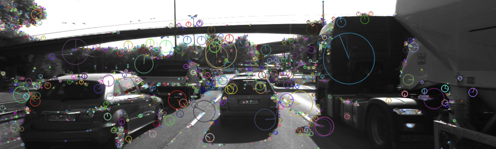

# SFND 2D Feature Tracking

The idea of the camera course is to build a collision detection system - that's the overall goal for the Final Project. As a preparation for this, we will now build the feature tracking part and test various detector / descriptor combinations to see which ones perform best. This project consists of four parts:

* First, you will focus on loading images, setting up data structures and putting everything into a ring buffer to optimize memory load. 
* Then, you will integrate several keypoint detectors such as HARRIS, FAST, BRISK and SIFT and compare them with regard to number of keypoints and speed. 
* In the next part, you will then focus on descriptor extraction and matching using brute force and also the FLANN approach we discussed in the previous lesson. 
* In the last part, once the code framework is complete, you will test the various algorithms in different combinations and compare them with regard to some performance measures. 

## Dependencies for Running Locally
* cmake >= 2.8
  * All OSes: [click here for installation instructions](https://cmake.org/install/)
* make >= 4.1 (Linux, Mac), 3.81 (Windows)
  * Linux: make is installed by default on most Linux distros
  * Mac: [install Xcode command line tools to get make](https://developer.apple.com/xcode/features/)
  * Windows: [Click here for installation instructions](http://gnuwin32.sourceforge.net/packages/make.htm)
* OpenCV >= 4.1
  * This must be compiled from source using the `-D OPENCV_ENABLE_NONFREE=ON` cmake flag for testing the SIFT and SURF detectors.
  * The OpenCV 4.1.0 source code can be found [here](https://github.com/opencv/opencv/tree/4.1.0)
* gcc/g++ >= 5.4
  * Linux: gcc / g++ is installed by default on most Linux distros
  * Mac: same deal as make - [install Xcode command line tools](https://developer.apple.com/xcode/features/)
  * Windows: recommend using [MinGW](http://www.mingw.org/)

## Basic Build Instructions

1. Clone this repo.
2. Make a build directory in the top level directory: `mkdir build && cd build`
3. Compile: `cmake .. && make`
4. Run it: `./2D_feature_tracking`.

## Benchmarking

I ran different combinations of detectors and descriptors to check their performance and accuracy and tabulated the numbers.
I used  KNN match selection (k=2) and performed descriptor distance ratio filtering with t=0.8 in file `matching2D.cpp`.

|Sr. No. | Detector + Descriptor |Total Keypoints |Total Matches |Total Time (ms) |Ratio (matches/time) |
|:---:|:---:|:----:|:-----:|:-----:|:-----:|
|1 | SHITOMASI + BRISK |13423 |4912 |338.80 |14.5 |
|2 | SHITOMASI + BRIEF |13423 |6625 |219.82 |30.15 |
|3 | *SHITOMASI + ORB |13423 |5673 |220.91 |25.71* |
|4 | SHITOMASI + FREAK |13423 |4084 |622.21 |6.564 |
|5 | SHITOMASI + SIFT |13423 |9484 |474.33 |19.99 |
|6 | SHITOMASI + AKAZE |NaN |NaN |NaN |NaN |
|7 | HARRIS + BRISK |728 |410 |202.91 |2.02 |
|8 | HARRIS + BRIEF |728 |477 |180.05 |2.65 |
|9 | HARRIS + ORB |728 |427 |193.54 |2.21 |
|10 | HARRIS + FREAK |728 |290 |543.42 |0.53 |
|11 | HARRIS + AKAZE |N/A |N/A |N/A |N/A|
|12 | HARRIS + SIFT |728 |554 |384.82 |1.439 |
|13 | FAST + BRISK |49204 |14267 |503.38 |28.34 |
|14 | *FAST + BRIEF |49204 |19554 |195.83 |99.85* |
|15 | *FAST + ORB |49204 |16896 |107.25 |157.54* |
|16 | FAST + FREAK |49204 |11717|799.77 |14.65 |
|17 | FAST + AKAZE |N/A |N/A |N/A |N/A|
|18 | FAST + SIFT |49204 |30082 |2134.49 |14.09 |
|19 | BRISK + BRISK |27116 |9563 |4139.32 |2.31 |
|20 | BRISK + BRIEF |27116 |11426|3924.53 |2.91 |
|21 | BRISK + ORB |27116 |7039 |3879.17 |1.81 |
|22 | BRISK + FREAK |27116 |7780 |4472.89|1.74 |
|23 | BRISK + AKAZE |N/A |N/A |N/A |N/A|
|24 | BRISK + SIFT |27116 |15279 |6428.55 |2.38|
|25 | ORB + BRISK |5000 |2427 |141.03 |17.21 |
|26 | ORB + BRIEF |5000 |1822 |109.10 |16.70 |
|27 | ORB + ORB |5000 |1996 |134.08 |14.89 |
|28 | ORB + FREAK |5000 |920 |522.93 |1.76 |
|29 | ORB + AKAZE |N/A |N/A |N/A |N/A|
|30 | ORB + SIFT |5000 |3360 |1520.63 |2.21 |
|31 | AKAZE + BRISK |13429 |6689 |1007.71 |6.81 |
|32 | AKAZE + BRIEF |13429 |7008 |915.58 |7.65 |
|33 | AKAZE + ORB |13429 |5111 |940.723 |5.43 |
|34 | AKAZE + FREAK |13429 |5319 |1313.15 |4.05 |
|35 | AKAZE + AKAZE |13429 |8036 |1654.58 |4.86 |
|36 | AKAZE + SIFT |13429 |9489 |1478.94|6.42 |
|37 | SIFT + BRISK |13860 |4285 |1391.25 |3.08 |
|38 | SIFT + BRIEF |13860 |4553 |1357.28 |3.36 |
|39 | SIFT + ORB |13860 |Out of Memory error |Out of Memory error |Out of Memory error 
|40 | SIFT + FREAK |13860 |3334 |2334.01 |1.43 |
|41 | SIFT + AKAZE |13860|N/A |N/A| N/A|
|42 | SIFT + SIFT |13860 |7020 |2298.95 |3.05 |

The best three pairs of detectors/descriptors combinations are shown below based on their performance.

|Sr. No. | Detector + Descriptor |Total Keypoints |Total Matches |Total Time (ms) |Ratio (matches/time) |
|:---:|:---:|:----:|:-----:|:-----:|:-----:|
|15 | *FAST + ORB |49204 |16896 |107.25 |157.54* |
|14 | *FAST + BRIEF |49204 |19554 |195.83 |99.85* |
|3 | *SHITOMASI + ORB |13423 |5673 |220.91 |25.71* |
